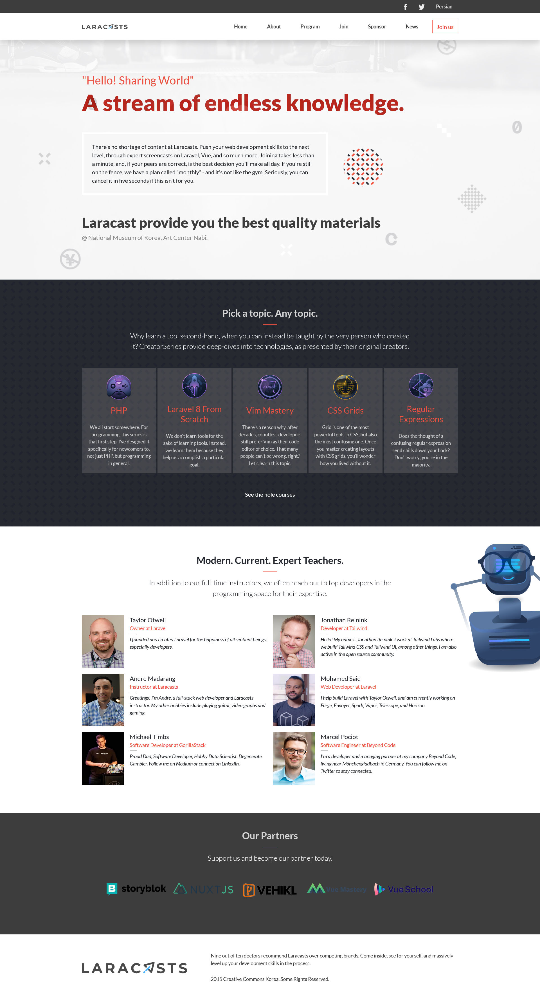
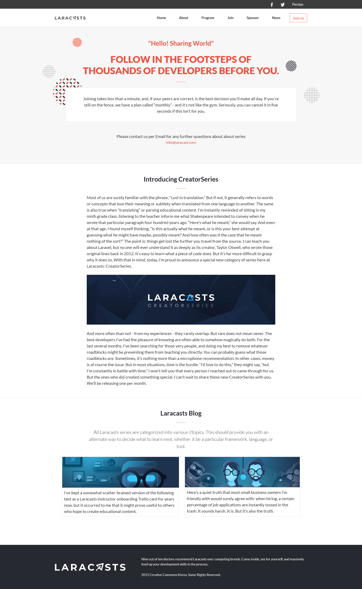

# CC Global Summit 2015 - Cindy Shin

This is a solution to the [CC Global Summit 2015](https://www.behance.net/gallery/29845175/CC-Global-Summit-2015)
by Cindy Shin.
Also the content of this challenge is customized based on [Laracasts](https://laracasts.com/) website.

## Table of contents

- [Overview](#overview)
  - [The challenge](#the-challenge)
  - [Screenshot](#screenshot)
  - [Links](#links)
  - [Setup](#setup)
- [My process](#my-process)
  - [Built with](#built-with)
- [Author](#author)
- [Contributing](#Contributing)
- [Acknowledgments](#Acknowledgments)

## Overview

### The challenge

Users should be able to:

- View the optimal layout for the app depending on their device's screen size.
- The home page should have a link in the menu to the about page.
- The logo in the header links to the home page.
- When the user clicks (or taps) the hamburger button on the header, the mobile menu appears over the page.
- There are no guidelines for the mobile menu in the docs, but you should implement it so it is consistent with the design (colors, typography, spacings, etc.).
- The mobile menu should have a close (X) button that closes the menu.
- The section "Featured speakers" should be created dynamically in JavaScript.

### Screenshot

- Screenshot of the solution

- Screenshot of the solution

### Links

- Challenge URL: [https://www.behance.net/gallery/29845175/CC-Global-Summit-2015/](https://www.behance.net/gallery/29845175/CC-Global-Summit-2015/)
- Live Site URL: [https://mahdisohaily.github.io/Programing-Bootcamp/](https://mahdisohaily.github.io/Programing-Bootcamp/)

### Setup
To run this project you have to follow the following steps.
- `git clone https://github.com/MahdiSohaily/Programing-Bootcamp.git`
- `cd Programing-Bootcamp`
- `npm run install`
- `npm run css-compile`
- `npm run server`

Also take a look to the `package,json` file for other available options.

## My process

### Built with

- Semantic HTML5 markup
- CSS custom properties
- Flex box
- CSS Grid
- Mobile-first workflow
- stylelint
- Auto autoprefixer
- Post CSS
- Purge CSS
- [bootstrap](https://getbootstrap.com/) - frontend framework
- [sass](https://sass-lang.com/) - CSS preprocessor
- [vite.js](https://vitejs.dev/) - Vite is a build tool
## Author
 👤 **Mahdi Rezaei**
- LinkedIn - [@MahdiSohaily](https://www.linkedin.com/in/mahdi-rezaei-74705713b/)
- Twitter - [@Mahdi_Rezaei_AF](https://twitter.com/Mahdi_Rezaei_AF)

## 🤝 Contributing

Contributions, issues, and feature requests are welcome!

Feel free to check the [issues page](../../issues/).

## Show your support

Give a ⭐️ if you like this project!

## Acknowledgments

- This is a solution to the [CC Global Summit 2015](https://www.behance.net/gallery/29845175/CC-Global-Summit-2015)
by Cindy Shin.
- Also the content of this challenge is customized based on [Laracasts](https://laracasts.com/) website.

## 📝 License

This project is [MIT](./LICENSE) licensed.