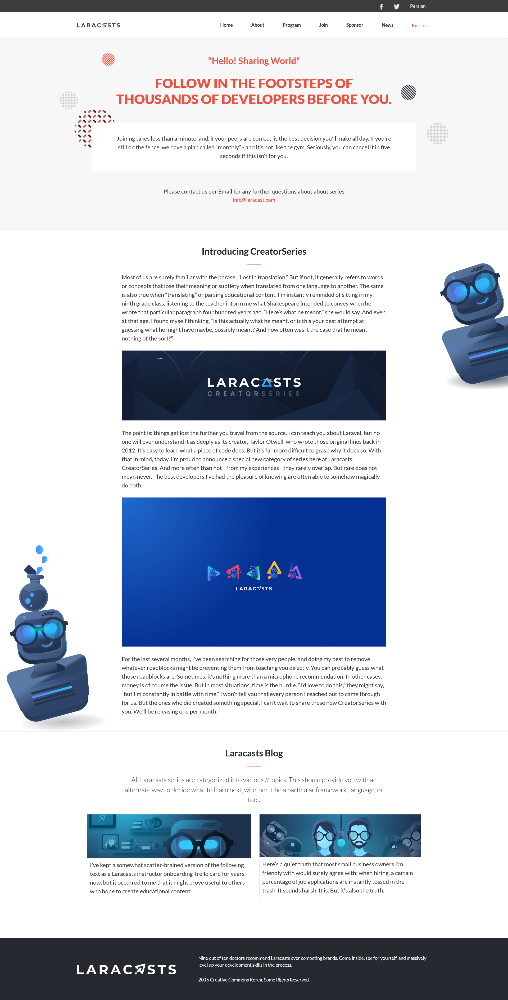

# CC Global Summit 2015 - Cindy Shin

This is a solution to the [CC Global Summit 2015](https://www.behance.net/gallery/29845175/CC-Global-Summit-2015)
by Cindy Shin

## Table of contents

- [Overview](#overview)
  - [The challenge](#the-challenge)
  - [Screenshot](#screenshot)
  - [Links](#links)
- [My process](#my-process)
  - [Built with](#built-with)
- [Author](#author)

## Overview

### The challenge

Users should be able to:

- View the optimal layout for the app depending on their device's screen size.
- The home page should have a link in the menu to the about page.
- The logo in the header links to the home page.
- When the user clicks (or taps) the hamburger button on the header, the mobile menu appears over the page.
- There are no guidelines for the mobile menu in the docs, but you should implement it so it is consistent with the design (colors, typography, spacings, etc.).
- The mobile menu should have a close (X) button that closes the menu.
- The section "Featured speakers" should be created dynamically in JavaScript.

### Screenshot

- Screenshot of the solution

- Screenshot of the solution

### Links

- Challenge URL: [Challenge URL](https://www.behance.net/gallery/29845175/CC-Global-Summit-2015/)
- Live Site URL: [Live site URL](https://mahdisohaily.github.io/Programing-Bootcamp/)

## My process

### Built with

- Semantic HTML5 markup
- CSS custom properties
- Flex box
- CSS Grid
- Mobile-first workflow
- stylelint
- Auto autoprefixer
- Post CSS
- Purge CSS
- [bootstrap](https://getbootstrap.com/) - frontend framework
- [sass](https://sass-lang.com/) - CSS preprocessor
- [vite.js](https://vitejs.dev/) - Vite is a build tool
## Author
 **Mahdi Rezaei**
- LinkedIn - [@MahdiSohaily](https://www.linkedin.com/in/mahdi-rezaei-74705713b/)
- Twitter - [@Mahdi_Rezaei_AF](https://twitter.com/Mahdi_Rezaei_AF)